# Surveysaurus-ui

## HomePage Kısım 1 

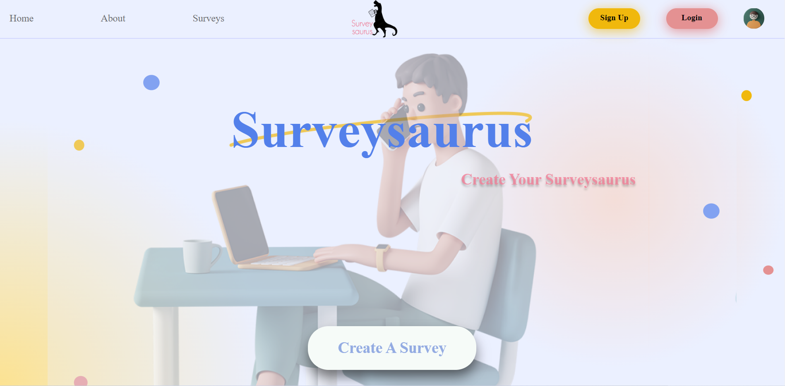

- HomePage menü ve create a survey görünümü.
- Create a survey butonuna tıklayarak anket oluşturma sayfasına ulaşabilirsiniz.
- Sign Up butonuna tıklayarak kayıt oluşturma sayfasına ulaşıp kayıt olabilirsiniz.
- Login butonuna tıklayarak giriş sayfasına ulaşıp giriş yapabilirsiniz.

## HomePage Kısım 2 

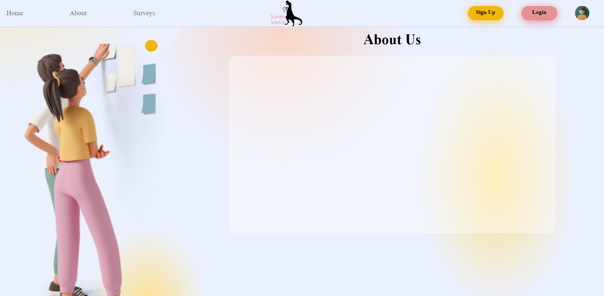

- HomePage about görünümü.
- Menü kısmından about'a tıklayarak about kısmına ulaşabilirsiniz.

## HomePage Kısım 3 

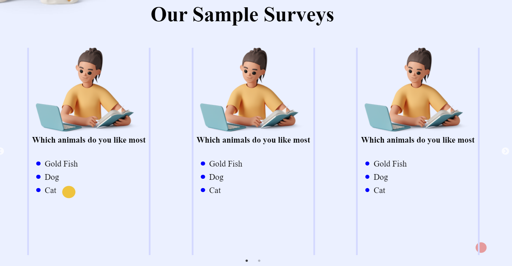

- HomePage our sample surveys görünümü.
- Menü kısmından surveys'e tıklayarak surveys kısmına ulaşabilirsiniz.
- Slider kısmından anketlere ulaşarak tıkladığınız ankete oy verebilirsiniz ve yorum yapabilirsiniz.
- Slider kısmındaki sağdaki ve soldaki okları kullanarak ve alttaki noktalara tıklayarak aynı işlemleri yapabilirsiniz.
- Click to create butonuna tıklayarak anket oluşturma sayfasına ulaşabilirsiniz.

## HomePage Kısım 4

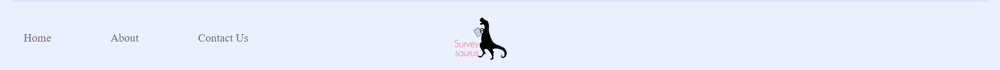

- HomePage footer görünümü.
- Footer kısmından da menüdeki aynı işlemleri yapabilirsiniz.
- Footer'dan contact us kısmına gidebilirsiniz.

## Sign Up

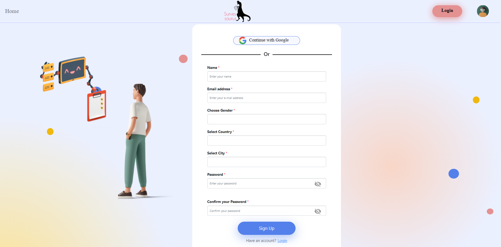

- Sign Up sayfa görünümü
- Name, email adress, choose gender, select country, select city, password, confirm your password kısımlarını doldurarak siteye kayıt olabilirsiniz.

## Login

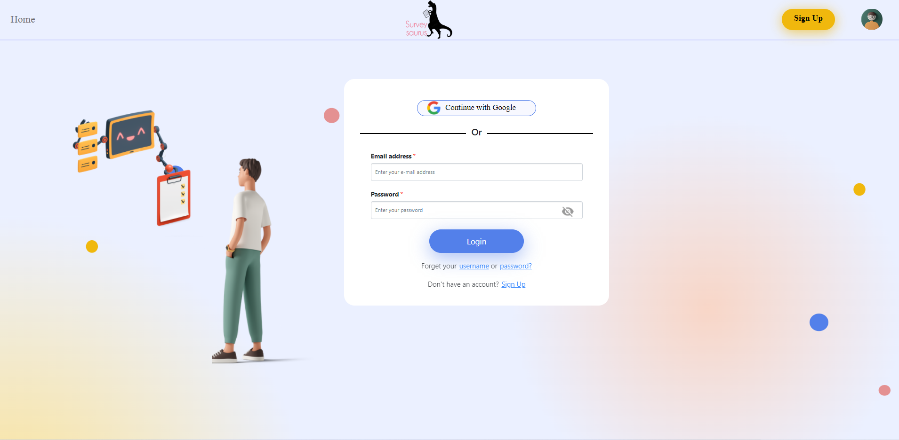

- Login sayfa görünümü
- Email adress, password kısımlarını doldurarak siteye giriş yapabilirsiniz.

## Giriş Yapıldıktan Sonra Açılan Pencere(UserPage)

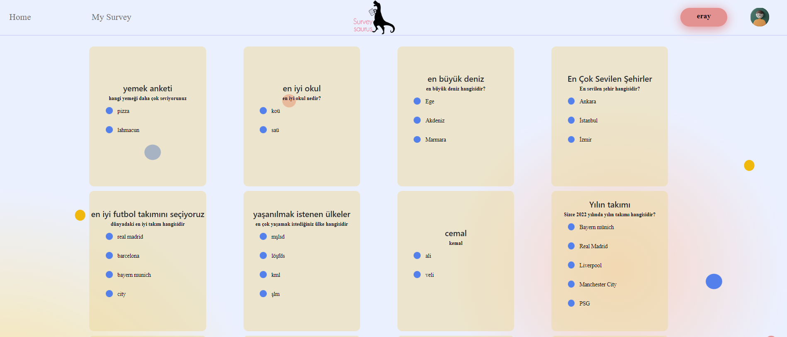

- UserPage sayfa görünümü
- İstediğiniz anket kartına tıklayarak o anketin oy verme sayfasına ulaşıp yorum verebilir ve oy kullanabilirsiniz.

## UserPage Açılır Menü

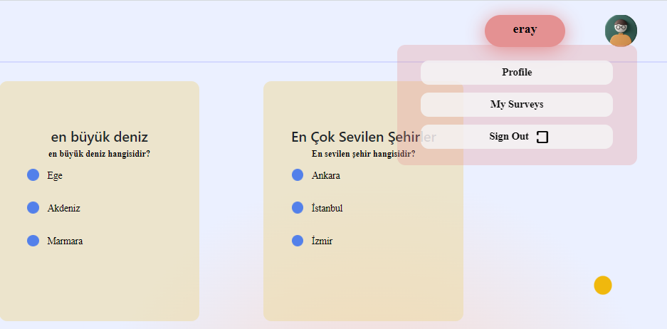

- UserPage açılır menü görünümü
- Profile kısmına tıklayarak UserInfo sayfasına ulaşabilirsiniz.
- My Surveys kısmına tıklayarak bulunduğunuz UserPage sayfasına geri dönebilirsiniz
- Sign Out kısmına tıklayarak siteden çıkış yapıp login ekranına ulaşabilirsiniz.

## UserPage Create Survey Kartı

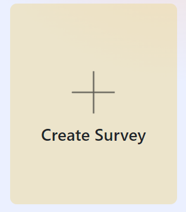

- Create Survey kart görünümü
- Create Survey kartına tıklayıp createsurvey sayfasına ulaşıp yeni anket oluşturabilirsiniz.

## CreateSurvey 

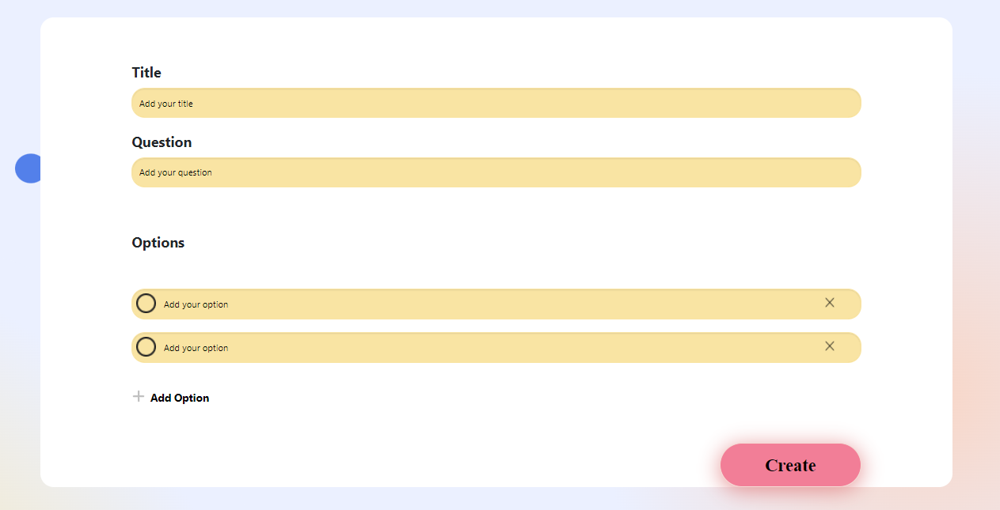

- CreateSurvey sayfa görünümü
- Title, question, options(seçenekleri add option butonu ile arttırabilirsiniz) bilgilerini girip create butonu tıklayarak anketinizi oluşturabilirsiniz.

## FillSurvey

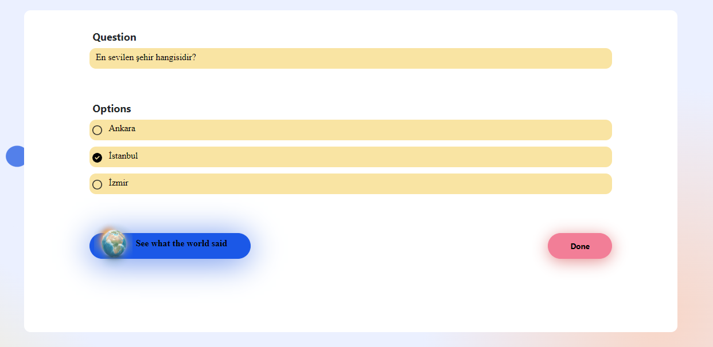

- FillSurvey sayfa görünümü
- Ankete oy kullanabilirsiniz ve done butonu tıklayarak anketin oy yüzdelerini görebilirsiniz.
- Kullanıcı isterse sayfayı yenileyip oyunu değiştirebilir.
- See what the World said butonuna tıklayarak diğer kullanıcıların Dünya haritası üzerindeki tercihlerini görüntüleyebilirsiniz.

## FillSurvey Kısım 2

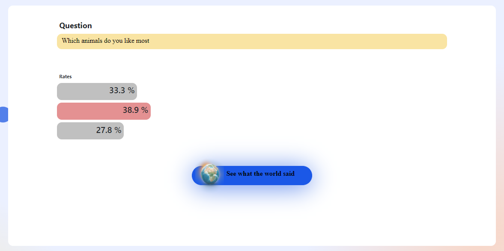

- FillSurvey done butonu sonrası sayfa görünümü
- Oy kullandığınız anketin oy kullanım yüzdelerini görebilirsiniz.

## FillSurvey Kısım 3

- FillSurvey comment kısmı sayfa görünümü
- Burada yorum ekleyebilir, diğer kullanıcıların yorumlarına cevap verebilirsiniz.
- Kullanıcı istediği yorumu upVote edebilir, yanıtlayabilir ve Report edebilir.
- Kullanıcı eklediği yorumunu istediği zaman Delete butonuna tıklayarak kaldırabilir.

## Siteye Aşağıdaki linkten ulabilirsiniz

- [Sayfa Linki](http://40.113.137.113/)

# Getting Started with Create React App

This project was bootstrapped with [Create React App](https://github.com/facebook/create-react-app).

## Available Scripts

In the project directory, you can run;

### `npm start`

Runs the app in the development mode.\
Open [http://localhost:3000](http://localhost:3000) to view it in your browser.

The page will reload when you make changes.\
You may also see any lint errors in the console.

### `npm test`

Launches the test runner in the interactive watch mode.\
See the section about [running tests](https://facebook.github.io/create-react-app/docs/running-tests) for more information.

### `npm run build`

Builds the app for production to the `build` folder.\
It correctly bundles React in production mode and optimizes the build for the best performance.

The build is minified and the filenames include the hashes.\
Your app is ready to be deployed!

See the section about [deployment](https://facebook.github.io/create-react-app/docs/deployment) for more information.

### `npm run eject`

**Note: this is a one-way operation. Once you `eject`, you can't go back!**

If you aren't satisfied with the build tool and configuration choices, you can `eject` at any time. This command will remove the single build dependency from your project.

Instead, it will copy all the configuration files and the transitive dependencies (webpack, Babel, ESLint, etc) right into your project so you have full control over them. All of the commands except `eject` will still work, but they will point to the copied scripts so you can tweak them. At this point you're on your own.

You don't have to ever use `eject`. The curated feature set is suitable for small and middle deployments, and you shouldn't feel obligated to use this feature. However we understand that this tool wouldn't be useful if you couldn't customize it when you are ready for it.

## Learn More

You can learn more in the [Create React App documentation](https://facebook.github.io/create-react-app/docs/getting-started).

To learn React, check out the [React documentation](https://reactjs.org/).

### Code Splitting

This section has moved here: [https://facebook.github.io/create-react-app/docs/code-splitting](https://facebook.github.io/create-react-app/docs/code-splitting)

### Analyzing the Bundle Size

This section has moved here: [https://facebook.github.io/create-react-app/docs/analyzing-the-bundle-size](https://facebook.github.io/create-react-app/docs/analyzing-the-bundle-size)

### Making a Progressive Web App

This section has moved here: [https://facebook.github.io/create-react-app/docs/making-a-progressive-web-app](https://facebook.github.io/create-react-app/docs/making-a-progressive-web-app)

### Advanced Configuration

This section has moved here: [https://facebook.github.io/create-react-app/docs/advanced-configuration](https://facebook.github.io/create-react-app/docs/advanced-configuration)

### Deployment

This section has moved here: [https://facebook.github.io/create-react-app/docs/deployment](https://facebook.github.io/create-react-app/docs/deployment)

### `npm run build` fails to minify

This section has moved here: [https://facebook.github.io/create-react-app/docs/troubleshooting#npm-run-build-fails-to-minify](https://facebook.github.io/create-react-app/docs/troubleshooting#npm-run-build-fails-to-minify)
